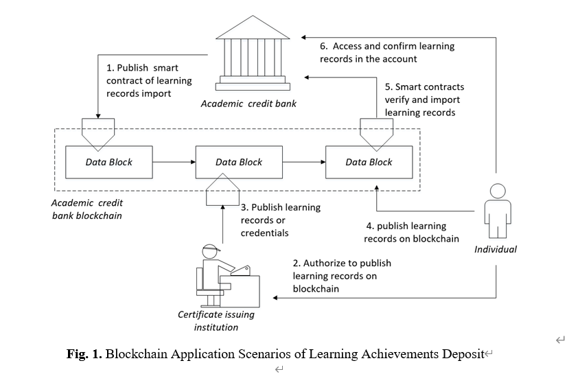
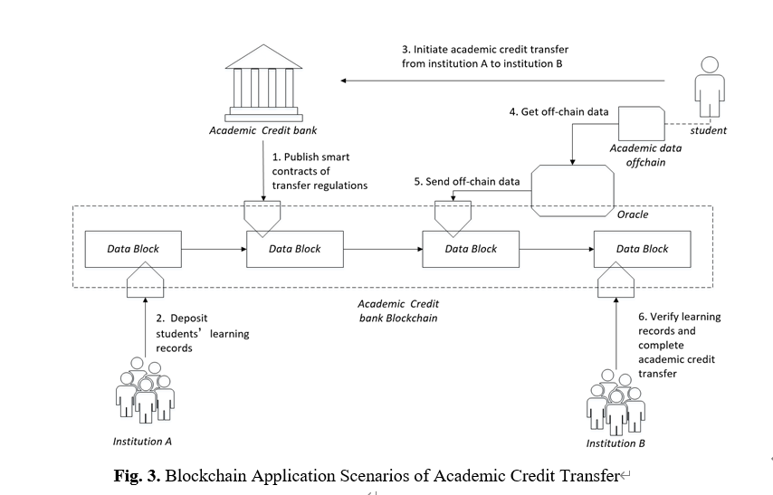
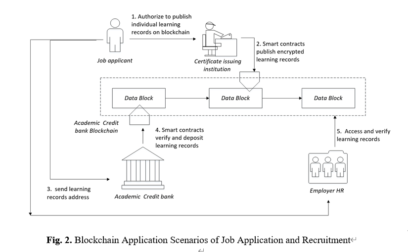

# 长三角学分银行功能演示

[预览地址](https://montecarloclub.github.io/bank)

## 学习成果上链




## 学分转换




## 求职招聘




## 运行

### 配环境

本地有 node 和 npm、pnpm 的环境，运行以下指令查看版本

``` bash
$ node -v
$ npm -v
$ pnpm -v
```

如果 `pnpm -v` 报错的话，就手动全局安装一下 pnpm（理解为 npm 的升级版）

```bash
$ npm install -g pnpm
$ pnpm -v
```

### 跑项目

``` bash
$ pnpm install
$ pnpm run dev
```

## 更新日志

### 2022-09-25

- [x] 去掉单步运行
- [x] 按照流程图来所有步骤都做一下
- [x] 每一个图标下方都用文字标注图标的意义
- [x] 学习者，长三角学分银行（上海/江苏/浙江/安徽），发证机构
- [x] 用虚线框把区块链框起来
- [x] 每个步骤之间的间隔久一些（3 秒）
- [x] 首页上加个标题：长三角学分银行
- [x] 每个场景上面加一个导航栏，在场景之间切换
- [x] 图标（机构）的颜色可以几个区分
- [x] 学分转换放到第二个，“求职/招聘”放到第三个

### 2022-09-26

- [x] 步骤的文字会被覆盖，展示不下可以换行
- [x] 图标的布局要调整宽一些
- [x] 步骤里文字的内容也和演示图的一致
- [x] 区块链名称的字体和其它文字一致
- [x] 图标移动的速度慢一些
- [x] 画一个箭头从学习者到学分银行
- [x] “初始化机构之间的转换” 改成 “发起转换请求”
- [x] “苏州市” 改成 “江苏省”
- [x] 根据同一种类型的图标用同一种颜色
- [x] 招聘场景：“招聘人员” 改成 “招聘单位HR”
- [x] 首页：“长三角学分银行应用场景演示“
- [x] 适配分辨率低的场景


### 2022-09-27

- [x] 宽度和高度缩小一些
- [x] 每一个步骤的轨迹保留，不用消失
- [x] 首页上每个场景的入口全换成按钮，把流程图下掉